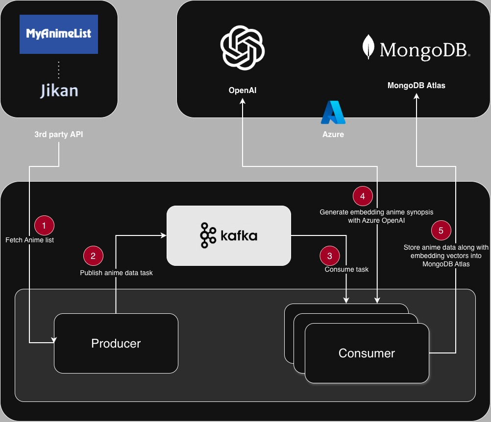

# My RAG AI Isn't That Hard to Build


## Introduction
Welcome to the RAG AI Anime Search application!

This project is a Retrieval-Augmented Generation (RAG) AI designed to help users search for anime based on their synopsis. By leveraging Azure OpenAI and a vector database, the application delivers accurate and context-aware anime recommendations.

Whether you’re looking for similar anime, exploring new titles, or simply curious about a synopsis, this AI-powered tool makes discovering anime faster and more intuitive.

## Features
- **Search by Synopsis**: Enter a synopsis to find anime recommendations.

## Overview architecture


## Pre-requisites
- [Bun](https://bun.sh/)
- [Node.js](https://nodejs.org/en/)
- [MongoDB Atlas Account](https://www.mongodb.com/cloud/atlas)
- [Azure OpenAI Account](https://azure.microsoft.com/en-us/services/cognitive-services/openai/)
  - With the following models:
    - [`text-ada-002`](https://learn.microsoft.com/en-us/azure/ai-services/openai/concepts/models?tabs=global-standard,standard-chat-completions#embeddings)
    - One of the following:
      - [`gpt-3.5-turbo`](https://learn.microsoft.com/en-us/azure/ai-services/openai/concepts/models?tabs=global-standard,standard-chat-completions#embeddings)
      - [`gpt-4o`](https://learn.microsoft.com/en-us/azure/ai-services/openai/concepts/models?tabs=global-standard,standard-chat-completions#embeddings)

- **Anime Database** embedded using [`text-ada-002`](https://learn.microsoft.com/en-us/azure/ai-services/openai/concepts/models?tabs=global-standard,standard-chat-completions#embeddings) model
  - HINT: You can retrieve the anime database from [jikan](https://jikan.moe/)

## Setup Project
### Download the anime dataset

This project dataset is based on the [Jikan API](https://jikan.moe/) which provides a comprehensive database of anime information.

In this project, we will obtain the anime dataset from Jikan API and embed the synopsis using Azure OpenAI `text-embedding-ada-002` model, then store the embedded data into MongoDB for vector search.

Due to the large size of the anime dataset, we will use Kafka as a message broker to handle the data processing in a producer-consumer pattern.



1. Setup Kafka and MongoDB
2. Setup the environment variables in the `tools/anime-puller/.env` file.
```bash
AZURE_OPENAI_ENDPOINT=""
AZURE_OPENAI_API_KEY=""
AZURE_OPENAI_EMBEDDING_DEPLOYMENT_NAME="text-embedding-ada-002"
AZURE_OPENAI_COMPLETION_DEPLOYMENT_NAME="gpt-35-turbo"

MONGO_URI=""
MONGO_DB=""
BROKER_URL=""
TEXT_EMBEDDING_AI="azure-openai"
```
3. Install the dependencies
```bash
cd tools/anime-puller
bun install
```
4. Run the anime puller process, start the producer to pull the anime dataset and push to Kafka topic.
```bash
bun run ./src/start_producer.ts
```
5. In a separate terminal, start the consumer to read from Kafka topic and store the embedded anime data into MongoDB.
```bash
bun run ./src/start_consumer.ts
```

6. Once the dataset is populated and the consumer has processed all messages, you can stop both the producer and consumer processes by pressing `Ctrl + C` in their respective terminal windows.

### Create a MongoDB Vector Index

There is so many ways to create a vector index in MongoDB. You can follow the official documentation [here](https://www.mongodb.com/docs/atlas/atlas-vector-search/vector-search-type/?interface=atlas-ui&deployment-type=atlas).

For this anime sample dataset, you can create a vector index on the `content_rating_filter` field in the `embedded_aoai_anime_list` collection following the Index Definition below:

```json
{
  "fields": [
    {
      "type": "vector",
      "path": "content_embedding",
      "numDimensions": 1536,
      "similarity": "cosine"
    },
    {
      "type": "filter",
      "path": "rating"
    }
  ]
}
```

Explanation:
- The `content_embedding` field is defined as a vector field with 1536 dimensions, which matches the output size of the `text-embedding-ada-002` model used for generating embeddings.
- The `rating` field is defined as a filter field, allowing for filtering search results based on content ratings.
- The similarity metric is set to `cosine`, which is commonly used for measuring the similarity between high-dimensional vectors.


## Usage - Start the Application

1. Configure the environment variables in the `api/.env` file.
```bash
MONGO_URI=""
AZURE_OPENAI_ENDPOINT=""
AZURE_OPENAI_API_KEY=""
AZURE_OPENAI_EMBEDDING_DEPLOYMENT_NAME="text-embedding-ada-002"
AZURE_OPENAI_COMPLETION_DEPLOYMENT_NAME="gpt-35-turbo"
```

2. Start the API Server
- Run the following commands in the terminal:
```bash
cd api
bun install
bun run ./http.ts
```
3. Start the Frontend
- Run the following commands in the terminal:
```bash
cd ui
npm install
npm start
```