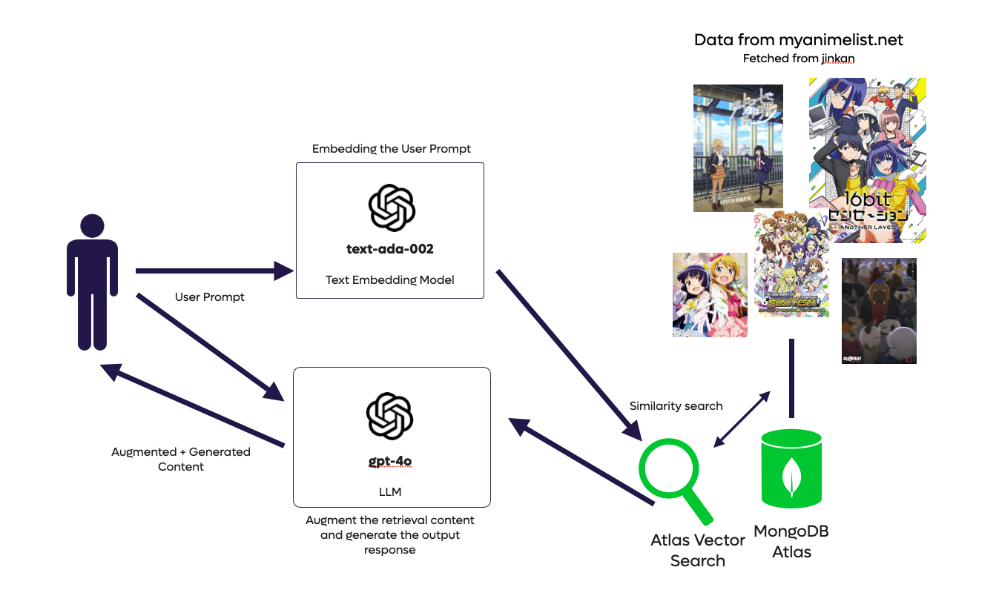

# My RAG AI Isn't That Hard to Build


## Introduction
Welcome to the RAG AI Anime Search application!

This project is a Retrieval-Augmented Generation (RAG) AI designed to help users search for anime based on their synopsis. By leveraging Azure OpenAI and a vector database, the application delivers accurate and context-aware anime recommendations.

Whether you’re looking for similar anime, exploring new titles, or simply curious about a synopsis, this AI-powered tool makes discovering anime faster and more intuitive.

## Features
- **Search by Synopsis**: Enter a synopsis to find anime recommendations.

## Overview architecture


## Pre-requisites
- [Bun](https://bun.sh/)
- [Node.js](https://nodejs.org/en/)
- [MongoDB Atlas Account](https://www.mongodb.com/cloud/atlas)
- [Azure OpenAI Account](https://azure.microsoft.com/en-us/services/cognitive-services/openai/)
  - With the following models:
    - [`text-ada-002`](https://learn.microsoft.com/en-us/azure/ai-services/openai/concepts/models?tabs=global-standard,standard-chat-completions#embeddings)
    - One of the following:
      - [`gpt-3.5-turbo`](https://learn.microsoft.com/en-us/azure/ai-services/openai/concepts/models?tabs=global-standard,standard-chat-completions#embeddings)
      - [`gpt-4o`](https://learn.microsoft.com/en-us/azure/ai-services/openai/concepts/models?tabs=global-standard,standard-chat-completions#embeddings)

- **Anime Database** embedded using [`text-ada-002`](https://learn.microsoft.com/en-us/azure/ai-services/openai/concepts/models?tabs=global-standard,standard-chat-completions#embeddings) model
  - HINT: You can retrieve the anime database from [jikan](https://jikan.moe/)

## Usage - Start the Application

1. Configure the environment variables in the `/api/.env` file.
2. Start the API Server
- Run the following commands in the terminal:
```bash
cd api
bun install
bun run ./api/http.ts
```
3. Start the Frontend
- Run the following commands in the terminal:
```bash
cd ui
npm install
npm start
```