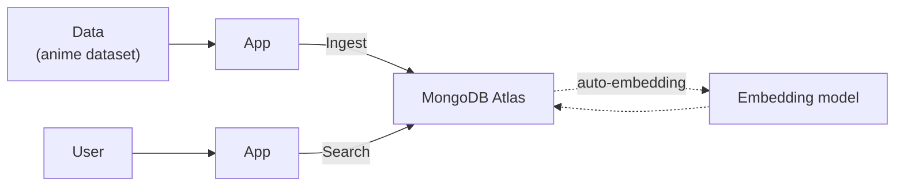
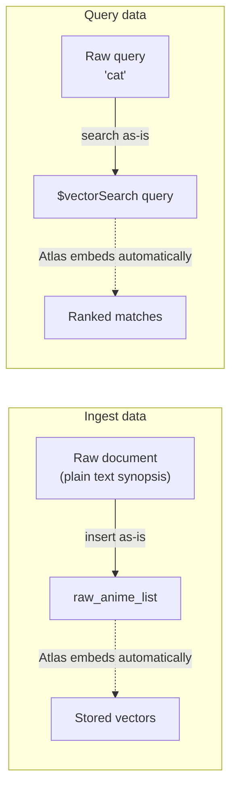
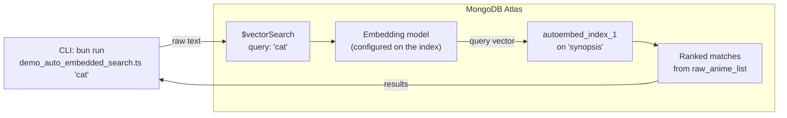

# Demo: Auto-Embedded Search (Server-Side Embedding)

`tools/app/demo_auto_embedded_search.ts` demonstrates MongoDB Atlas Vector
Search with **auto-embedding**. Here Atlas embeds both the stored field and the
query text for you, so at query time you pass the **raw text** via `query`
instead of pre-computing a `queryVector`.

> Learn more: [Automated embedding in Atlas Vector Search](https://www.mongodb.com/docs/vector-search/about/automated-embedding/?interface=driver&language=nodejs).

This is the key difference from the [client-side demo](./demo-search.md):

| | Client-side (`demo_search.ts`) | Auto-embedding (`demo_auto_embedded_search.ts`) |
| --- | --- | --- |
| Who embeds the query | Your app (Azure/Ollama/Voyage) | Atlas (server-side) |
| `$vectorSearch` field | `queryVector` (number[]) | `query` (raw text) |
| Client embedding call | Required | None |

```js
// Auto-embedding: just hand Atlas the raw text
{
  $vectorSearch: {
    index: "autoembed_index_1",
    query: "cat",
    path: "synopsis",
    numCandidates: 100,
    limit: 10
  }
}
```

## Components

A high-level view of how data and search requests flow through the system. The
embedding model lives **inside MongoDB Atlas** and is applied automatically on
both ingest and search.



## Ingest vs. query (the simple picture)

With auto-embedding, **you never compute embeddings yourself** — not when
storing data, and not when searching. You hand Atlas plain text both times.



- **Ingest:** insert the document with its plain-text field — no embedding step.
- **Query:** pass the plain-text query — no embedding step.
- Atlas handles both embeddings behind the scenes (dotted arrows).

## How it works



Atlas embeds the query text server-side using the model configured on the
auto-embedding index, then matches it against the pre-embedded `synopsis`
vectors — the client never computes an embedding.

## Prerequisites

- An Atlas Vector Search **auto-embedding** index on the target collection.
  By default the demo expects an index named `autoembed_index_1` on the
  `synopsis` field of the `raw_anime_list` collection. The index must be
  configured with an embedding model (so Atlas knows how to embed text) and a
  `rating` filter field.
- The `raw_anime_list` collection is populated (see
  [Running the Project](./running-the-project.md)).

> Because Atlas does the embedding, **no embedding provider env vars are needed**
> for this demo — only the MongoDB connection.

## Configure environment variables

Create `tools/app/.env`:

```bash
MONGO_URI=""
MONGO_DB_NAME=""

# Optional overrides (defaults shown)
AUTO_EMBED_INDEX="autoembed_index_1"
AUTO_EMBED_PATH="synopsis"
AUTO_EMBED_COLLECTION="raw_anime_list"
```

## Install dependencies

```bash
cd tools/app
bun install
```

## Run the demo

From `tools/app/`:

```bash
# Full output (whole documents)
bun run demo_auto_embedded_search.ts "cat"

# Compact output (title, rating, url, score)
bun run demo_auto_embedded_search.ts "cat" compact
```

- The **first argument** is the search query (raw text).
- The **second argument** is the log option: `full` (default) or `compact`.

## What you should see

```
🔎 Searching (auto-embedding)... cat
🧭 Index: autoembed_index_1 | Path: synopsis | Collection: raw_anime_list

📚 Found N results for "cat"
```

If you get `📚 Found 0 results`, the most common causes are:

- The auto-embedding index (`autoembed_index_1`) hasn't been created yet, or is
  still building.
- The index name/path/collection don't match your `AUTO_EMBED_*` values.
- The index isn't configured with an embedding model, so Atlas can't embed the
  `query` text.
